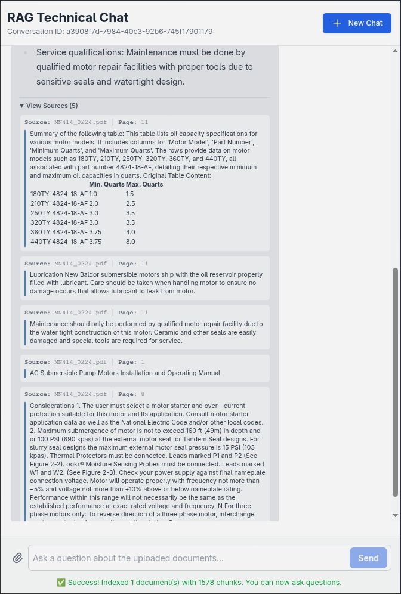

# 📄 RAG System for Technical Documents

This project is a solution for the **Machine Learning Engineering - LLM Challenge**. It implements a sophisticated, production-ready Retrieval-Augmented Generation (RAG) system that allows users to upload technical PDF documents and ask complex questions about their content.

The system features an advanced retrieval pipeline, a stateful conversational agent, and a clean, interactive web interface. It is designed to be robust, scalable, and highly accurate.

<table>
  <tr>
    <td align="center">
      
      <em>Step 1: Uploading documents and asking a question.</em>
    </td>
    <td align="center">
      
      <em>Step 2: Receiving a detailed answer with expandable sources.</em>
    </td>
  </tr>
</table>

-----

## ✨ Features

This implementation includes all core requirements and several optional enhancements:

* **PDF Document Ingestion**: Upload multiple PDF documents simultaneously via a REST API or a web interface.
* **Intelligent Content Extraction**: Uses `unstructured.io` for high-resolution text and table extraction, preserving document layout and structure.
* **🧠 LLM-Powered Table Summarization**: A key feature where an LLM analyzes extracted tables and generates rich, searchable summaries, making tabular data easily discoverable.
* **Advanced Retrieval Pipeline**:
  * **Parent-Document Retrieval**: Indexes small child chunks for efficient searching but retrieves larger parent chunks for better contextual understanding by the LLM.
  * **Cohere Reranking**: Implements a second-stage reranker to dramatically improve the relevance of retrieved documents before they are sent to the LLM.
* **Stateful Conversational Agent**: Built with **LangGraph**, the agent can handle multi-turn conversations, remember context, and use tools intelligently. Conversation history is persisted in a SQLite database.
* **Multi-Provider LLM with Fallbacks**: Supports multiple LLM providers (OpenAI, Google, Anthropic) and includes automatic fallback logic to ensure high availability.
* **Interactive Web UI**: A user-friendly frontend built with **FastAPI**, **Jinja2**, **HTMX**, and **Alpine.js** for a smooth, single-page application feel.
* **Dual API Endpoints**: Provides both a JSON API endpoint for programmatic access and an HTMX-powered endpoint for the web UI.

-----

## ✅ System Evaluation

We have conducted a rigorous, quantitative evaluation of this RAG system to measure its performance on real-world technical documents. The complete methodology, results, and analysis are detailed in a separate report.

**Key Highlights:**

* **Methodology**: A "golden dataset" of 28 question-answer pairs was manually generated from the source documents. An "LLM-as-a-Judge" (`gpt-4o`) was then used to score the RAG system's performance on a per-document basis.
* **Faithfulness Score: 1.00/1.00**: The system achieved a perfect score, indicating it does not hallucinate or invent information. All answers are strictly grounded in the provided source documents.
* **Answer Relevance Score: 0.84/1.00**: The system's answers are consistently accurate and on-topic, though there is an opportunity to improve their comprehensiveness.

For a full breakdown of the evaluation process, per-document scores, and illustrative examples, please see the complete report on [`EVALUATION.md`](/EVALUATION.md)

-----

## 🏗️ System Architecture

The system is split into two main pipelines: an **Indexing Pipeline** for processing documents and a **Query Pipeline** for answering questions.


1. **Indexing Pipeline (`POST /documents`)**:

      * **Upload**: User uploads PDF files via the API.
      * **Partitioning**: `unstructured` partitions each PDF into a list of elements (e.g., `Title`, `NarrativeText`, `Table`). This is done in parallel for multiple files.
      * **Summarization**: Table elements are sent to an LLM to generate keyword-rich summaries. This summary is prepended to the original table content.
      * **Chunking**: Documents (including summarized tables) are split into larger "parent documents". Each parent is then split into smaller, overlapping "child chunks".
      * **Storage**:
          * The parent documents are stored in an `InMemoryStore`.
          * The child chunks are converted to vector embeddings (using OpenAI) and stored in a persistent **ChromaDB** vector store.

2. **Query Pipeline (`POST /question`)**:

      * **Receive Question**: A user asks a question through the API or UI.
      * **Tool Call**: The LangGraph agent, following its system prompt, decides to use the `search_technical_documents` tool.
      * **Vector Search**: The user's query is embedded, and a similarity search is performed in ChromaDB to retrieve the most relevant *child chunks*.
      * **Parent Retrieval**: The system retrieves the corresponding *parent documents* for the top child chunks, providing broader context.
      * **Reranking**: The retrieved parent documents are passed to a **Cohere Rerank** model, which re-sorts them based on semantic relevance to the original query.
      * **Generation**: The top-ranked, reranked documents are passed to the LLM along with the original question. The LLM synthesizes this information to generate a final answer.
      * **Response**: The answer and the source document references are returned to the user.

-----

## 🤔 Trade-offs and Design Choices

* **Local vs. API-based PDF Parsing**: I chose `unstructured.io`'s local, open-source models (`strategy="hi_res"`) to make the project fully runnable without extra API keys for parsing. The trade-off is slower indexing speed compared to their paid cloud API. This decision prioritizes accessibility and cost-free setup for the challenge.
* **LangGraph vs. Standard LangChain Agent**: While a standard LangChain agent could work, I chose LangGraph to build the conversational agent. This provides explicit, stateful control over the agent's logic, making it easier to debug, extend, and manage complex multi-turn conversations and tool use cycles.
* **SQLite for Conversation History**: For this challenge, `SQLite` is a simple, file-based solution that requires no extra setup. In the "Deploying to Production" section, I explicitly outline moving this to a more robust database like PostgreSQL to handle concurrency, which is the correct trade-off for a production system.

-----

## 🛠️ Tech Stack

* **Backend Framework**: **FastAPI**
* **RAG & LLM Orchestration**: **LangChain**, **LangGraph**
* **PDF Processing**: `unstructured[pdf]`
* **Vector Database**: **ChromaDB**
* **LLM & Embedding Providers**:
  * **OpenAI**: For embeddings and primary generation.
  * **Google (Gemini)** & **Anthropic (Claude)**: For fallback generation.
  * **Cohere**: For the high-performance reranking model.
* **Frontend**: **Jinja2**, **HTMX**, **Alpine.js**, **Tailwind CSS**
* **Configuration**: **Pydantic**
* **Deployment**: Can be containerized with **Docker**.

-----

## 🚀 Getting Started

Follow these instructions to set up and run the project locally.

### Prerequisites

* Python 3.9+
* [**uv**](https://github.com/astral-sh/uv) installed.
* **System Dependencies for `unstructured`**: This library requires Poppler and Tesseract for its high-resolution PDF processing.
  * **macOS**:

      ```bash
      brew install poppler tesseract
      ```

  * **Ubuntu/Debian**:

      ```bash
      sudo apt-get install poppler-utils tesseract-ocr
      ```

  * **Windows**: Installation instructions for [Poppler](https://github.com/oschwartz10612/poppler-windows/releases/) and [Tesseract](https://github.com/tesseract-ocr/tessdoc/blob/main/Installation.md).

### Installation

1. **Clone the repository:**

    ```bash
    git clone git@github.com:m-lourenco0/rag-document-assistant.git
    cd rag-document-assistant
    ```

2. **Create a virtual environment using `uv`:**

    ```bash
    uv venv
    source .venv/bin/activate  # On Windows, use `.venv\Scripts\activate`
    ```

3. **Sync the dependencies:**

    ```bash
    uv sync
    ```

4. **Set up environment variables:**
    Create a file named `.env` in the root directory by copying the example file:

    ```bash
    cp .env.example .env
    ```

    Open the `.env` file and add your API keys. You will need keys for OpenAI and Cohere at a minimum.

    ```env
    # .env
    # Required for embeddings and primary LLM
    OPENAI_API_KEY="sk-..."

    # Required for the reranker tool
    COHERE_API_KEY="..."

    # Optional for LLM fallback capabilities
    ANTHROPIC_API_KEY="..."
    GOOGLE_API_KEY="..."
    ```

### Running the Application

Once the installation is complete, you can start the server using `uv run`. This executes the command within the project's virtual environment without needing to manually activate it.

```bash
uv run uvicorn src.main:app --host 0.0.0.0 --port 8000 --reload
```

The application will be running and accessible at `http://localhost:8000`.

-----

### Web UI

1. Open your browser and navigate to `http://localhost:8000`.
2. You will be automatically redirected to a new chat session with a unique URL (e.g., `http://localhost:8000/chat/<uuid>`).
3. Click the **paperclip icon** to select and upload one or more PDF documents. The upload and indexing process will start immediately.
4. A success message will appear when indexing is complete. The chat input will become enabled.
5. Ask questions about the documents you uploaded. You can view the source chunks used for each answer by expanding the "View Sources" dropdown.

-----

### API Endpoints

You can interact with the service programmatically using the following endpoints. For a complete, interactive API specification, the application provides Swagger UI documentation.

**Swagger Docs**: Available at **[http://localhost:8000/docs](http://localhost:8000/docs)**

#### 1. Upload Documents

Uploads one or more PDF files to be processed and indexed by the system.

* **Endpoint**: `POST /documents`
* **Request**: `multipart/form-data`

**Example `curl` Request:**

```bash
curl -X 'POST' \
  'http://localhost:8000/documents' \
  -H 'accept: application/json' \
  -H 'Content-Type: multipart/form-data' \
  -F 'files=@/path/to/your/document.pdf;type=application/pdf'
````

**Example Response:**

```json
{
  "message": "Documents processed successfully",
  "documents_indexed": 1,
  "total_chunks": 311
}
```

#### 2. Ask a Question (JSON API)

Submits a question about the indexed documents and receives a synthesized answer along with source references.

* **Endpoint**: `POST /api/question`
* **Request**: `application/json`

**Example `curl` Request:**

```bash
curl -X 'POST' \
  'http://localhost:8000/api/question' \
  -H 'accept: application/json' \
  -H 'Content-Type: application/json' \
  -d '{
  "question": "What are the steps for lubrication?",
  "thread_id": "some-unique-thread-id" // Used to maintain conversation history for the stateful agent.
}'
```

**Example Response:**

```json
{
  "answer": "The steps for lubrication of the motor bearings are as follows:\n\n1. Clean the grease fitting or the area around the grease hole if the motor is equipped with slotted grease screws.\n2. If the motor has a purge plug, remove it before lubrication.\n3. The motor can be regreased while stopped (at less than 80°C) or while running.\n4. Attach the grease gun to the fitting or grease hole.\n5. Slowly apply the recommended amount of grease, taking about 1 minute to apply. Avoid applying too much grease or injecting it too quickly, as this can cause premature bearing failure.\n6. After applying grease, operate the motor for 20 minutes.\n7. Reinstall the purge plug if it was removed earlier.\n\nIt is important to keep the grease clean and avoid mixing dissimilar greases. The motors are factory lubricated with Polyrex EM grease, but if other greases are preferred, consult a local Baldor Service Center for recommendations.\n\nThe amount of grease to add depends on the frame size of the motor, with specific quantities provided in ounces, grams, inches, and teaspoons for different frame sizes.",
  "references": [
    {
      "page_content": "Lubrication\n\nThis is a ball bearing motor. The bearings have been lubricated at the factory. Motors that do not have regrease capability are factory lubricated for the normal life of the bearings.\n\nRelubrication Intervals (For motors with rearease capability)\n\nNew motors that have been stored for a year or more should be relubricated. Lubrication is also recommended at these intervals:\n\nRelubrication Intervals\n\n* Lubrication interval for 6313 or 6314 bearings that are used in 360 through 5000 frame, 2 pole motors. If roller bearings are used, bearings must be lubricated more frequently, divide the interval by 2.",
      "metadata": {
        "filetype": "application/pdf",
        "filename": "LB5001.pdf",
        "page_number": 2,
        "element_id": "3a165e94dc3b1d52f53a3b71800e1261",
        "relevance_score": 0.22023381
      }
    },
    {
      "page_content": "Procedure\n\nClean the grease fitting (or area around grease hole, if equipped with slotted grease screws). If motor has a purge plug, remove it. Motors can be regreased while stopped (at less than 80°C) or running.\n\nApply grease gun to fitting (or grease hole). Too much grease or injecting grease to quickly can cause premature bearing failure. Slowly apply the recommended amount of grease, taking 1 minute or so to apply. Operate motor for 20 minutes, then reinstall purge plug if previously removed.",
      "metadata": {
        "filetype": "application/pdf",
        "filename": "LB5001.pdf",
        "page_number": 2,
        "element_id": "e97f04e77baa7760cced96c58d8ba023",
        "relevance_score": 0.16313887
      }
    }
  ]
}
```

-----

## 📂 Project Structure

The project follows a modular structure within the `src/` directory to separate concerns and improve maintainability.

```

src/
├── agent/
│   ├── agent.py            # Core LangGraph agent definition and logic
│   ├── factory.py          # Assembles the agent, tools, and LLM
│   ├── prompts.py          # System prompts for the agent and summarizer
│   └── tools.py            # Defines the advanced RAG retrieval tool
├── services/
│   ├── chat_service.py     # Handles agent interaction and response formatting
│   ├── document_indexer.py # Manages the entire PDF processing pipeline
│   ├── llm_provider.py     # Manages LLM instances and fallbacks
│   └── vector_store.py     # Manages the ChromaDB connection
├── templates/
│   ├── static/             # CSS, JS, and image assets
│   ├── fragments/          # HTML fragments for HTMX
│   ├── base.html           # Base Jinja2 template
│   └── index.html          # Main chat page template
├── config.py                # Pydantic settings management
├── logging_config.py        # Logging configuration
├── main.py                 # FastAPI application entrypoint
└── schemas.py              # Pydantic data models for API requests

```

-----

## 🚀 Deploying to Production

While this project is fully functional for local use and demonstration, running it in a production environment requires several key architectural changes to ensure scalability, reliability, and observability.

### 1. Application Server

The development server (`uvicorn` with `--reload`) is not suitable for production. You should use a production-grade process manager like **Gunicorn** to manage **Uvicorn** workers. This setup provides multi-process concurrency and resilience.

**Example:** Running the app with 4 worker processes.

```bash
uv run gunicorn -w 4 -k uvicorn.workers.UvicornWorker src.main:app
````

This is typically placed behind a reverse proxy like **Nginx** or a cloud load balancer.

### 2. Persistent and Scalable Storage

The default storage solutions (`SQLite`, local `ChromaDB`, and `InMemoryStore`) are not designed for production workloads.

* **Conversational Memory (Checkpointer)**: The `SqliteSaver` is not ideal for handling concurrent requests. You should switch to a more robust, network-accessible database. The `langgraph` library supports `PostgresSaver`, which is the recommended choice for production.

* **Vector Store**: A local `ChromaDB` instance is a single point of failure and does not scale. For production, migrate to a managed or self-hosted solution that offers backups, replication, and scalability.

  * **Hosted Vector DB**: Services like **Pinecone**, **Weaviate**, or a hosted version of **Chroma** are excellent, fully-managed options.
  * **PostgreSQL with `pgvector`**: This is a powerful choice if you want to co-locate your vector embeddings with other relational application data. It simplifies your infrastructure stack.
  * **OpenSearch/Elasticsearch**: These are great options for large-scale deployments, offering powerful filtering and analytics capabilities alongside dense vector search.

* **Parent Document Store**: **This is a critical change.** The default `InMemoryStore` will lose all parent documents every time the application restarts. This must be replaced with a persistent, fast key-value store like **Redis**. LangChain has a `RedisStore` that can be used as a drop-in replacement.

### 3. Decoupled Indexing Pipeline

Currently, the file indexing process runs synchronously within the main API process. A large upload could block the server, making it unresponsive. In production, this task should be decoupled.

* **Architecture**: Implement a message queue (**RabbitMQ**, **Redis**) and a separate worker service (e.g., using **Celery**).
* **Flow**:
    1. The API's `/documents` endpoint receives the files and places an "indexing job" onto the message queue.
    2. It immediately returns a `202 Accepted` response to the user with a job ID.
    3. A dedicated worker process, running independently from the API, pulls the job from the queue and performs the time-consuming indexing.
    4. The user can poll a separate `/jobs/{job_id}` endpoint to check the status of the indexing process.

### 4. Containerization and Orchestration

For consistent and reproducible deployments, the entire application stack should be containerized using **Docker**. A `docker-compose.yml` file would define the services:

* The FastAPI application.
* A PostgreSQL database for the checkpointer.
* A Redis instance for the document store and message queue.
* An indexing worker service.
* An Nginx reverse proxy.

This setup can then be deployed to any container orchestration platform like **Kubernetes** or **AWS ECS**.

### 5. Monitoring and Observability

The default logging to the console and local files is insufficient for production.

* **Structured Logging**: Configure the logger to output logs in a structured format like JSON. This makes them easily searchable in log management systems.
* **Application Monitoring**: Integrate with monitoring tools. Expose application metrics (e.g., request latency, error rates) using a library like `prometheus-fastapi-instrumentator` and visualize them in **Grafana** or **Datadog**.
* **LLM Observability (LangSmith)**: For debugging and monitoring the agent's behavior, integrating **LangSmith** is highly recommended. By setting a few environment variables, you can get detailed traces of every agent run, view the exact inputs/outputs of the LLM and tools, and analyze performance metrics like latency and token usage. This is crucial for understanding and improving the RAG pipeline's effectiveness.

-----

## ⚠️ Performance Considerations

This project uses the `unstructured` library with its **local inference models** for PDF parsing (`strategy="hi_res"`). This was a deliberate choice to ensure the project is free to run and accessible to everyone without requiring paid API keys for parsing.

However, local, CPU-based inference is computationally intensive. As a result, the **document indexing step can be slow**, especially for large PDFs or documents with many complex elements.

### Production Optimization Strategies

For a production environment where indexing speed is critical, consider the following optimizations:

* **Use a Faster Local Strategy**: In `src/services/document_indexer.py`, you can change the `unstructured` strategy from `"hi_res"` to `"fast"`. This will be significantly faster but may yield slightly lower-quality parsing for documents with very complex layouts.
* **Upgrade Infrastructure**: Deploy the application on a server with more powerful hardware. A machine with a high-core-count CPU, plenty of RAM, and especially a **GPU** will dramatically accelerate local model inference.
* **Leverage a Paid API**: For maximum speed and efficiency, you can modify the document indexer to use the `unstructured` cloud API, which offloads the heavy processing to their managed infrastructure.
* **Scale Horizontally**: For very high volumes, the indexing process can be refactored to use a distributed task queue (like Celery) with multiple worker machines processing documents in parallel.

-----

### 🔮 Future Work

This project provides a strong foundation for a production-grade RAG system. Based on the current implementation, here are the most logical and impactful next steps:

* **Hybrid Search**: Implement a hybrid search strategy that combines the existing semantic (vector) search with a traditional keyword-based search. This would significantly improve retrieval for queries that rely on specific codes, model numbers, or acronyms where exact lexical matching is crucial.

* **Multi-Modal Indexing for Images**: Extend the intelligent indexing pipeline to handle embedded images. Similar to the current LLM-powered table summarization, this would involve:
    1. Extracting images from the documents during the partitioning step.
    2. Passing them to a multi-modal model (like GPT-4o or Google Gemini) to generate rich, descriptive text summaries.
    3. Indexing these summaries alongside the text chunks.
    This would make visual content like diagrams, charts, and schematics fully searchable. This was a planned feature that was scoped out due to time constraints but remains a high-priority enhancement.

* **Agent Tool Expansion**: Increase the agent's capabilities by adding more specialized tools. For example, a `calculator` tool could perform numerical computations based on data retrieved from the documents, or a `data_visualizer` tool could generate plots from extracted table data.
